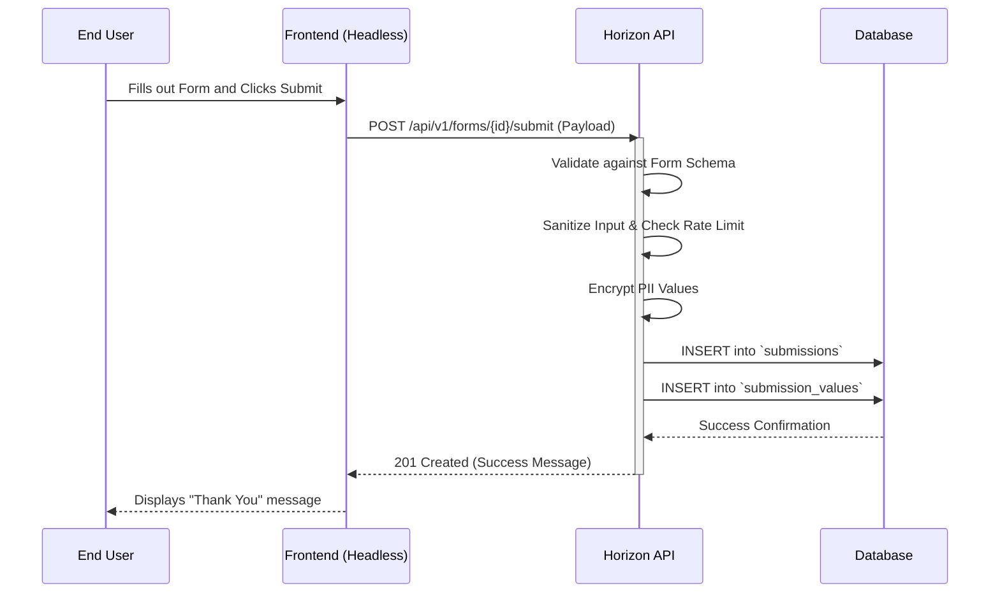
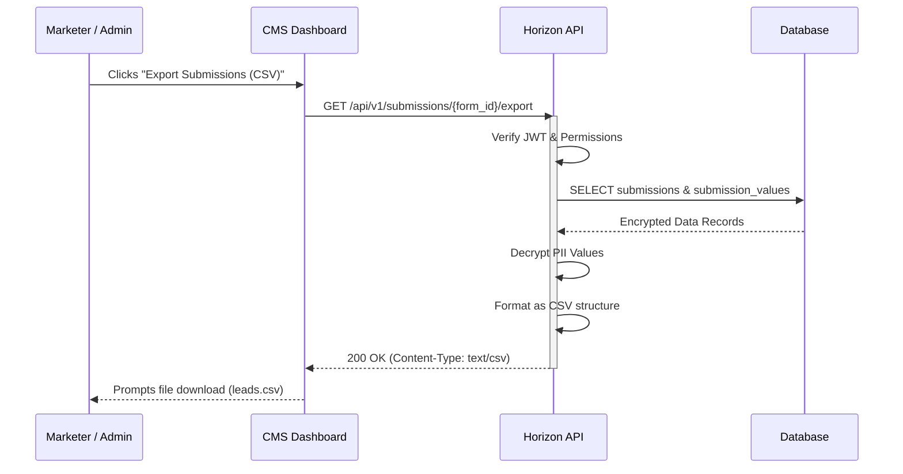

# Product Requirements Document (PRD)

**Project Name:** Horizon CMS (WordPress-Inspired MVP)
**Document Status:** Draft
**Target Release:** MVP v1.0
**Primary Stakeholders:** Engineering, Design, QA, Business Strategy
**Date:** May 31, 2026

---

## 1. Executive Summary

Horizon CMS is a modern, composable Content Management System MVP inspired by WordPress but built for the 2026 web ecosystem. It combines core content publishing features (Posts, Pages, Users, Comments) with a robust, no-code **Custom Form Builder**. By treating forms and content as equally vital primitives, Horizon empowers marketing and content teams to spin up campaigns and capture data rapidly, securely, and completely independent of developer intervention.

## 2. Problem Statement & Objectives

**The Problem:**
Legacy monolithic CMS platforms are increasingly bloated and prone to security vulnerabilities, while pure headless options often leave marketers without intuitive, no-code tools for data capture. Organizations need a way to build landing pages with custom lead-capture forms instantly, without sacrificing modern architectural flexibility, UI/UX adaptability, or stringent data privacy standards (GDPR/PII).

**Objectives (OKRs):**

- **Deliver Core Publishing:** Implement foundational CRUD operations for Posts, Pages, Users, Roles, and Comments.
- **Empower Marketers:** Provide a drag-and-drop form builder supporting text inputs, dropdowns, and checkboxes.
- **Secure Data Management:** Deliver a dedicated dashboard to view, manage, and export form submissions with 2026 security compliance.
- **Future-Proof Architecture:** Design API-first (headless-ready) structures that support generative UI and developer-led accessibility remediation.

## 3. Target Audience / Personas

- **Content Creator / Marketer (Primary):** Needs an intuitive, distraction-free interface to write articles, build landing pages, and generate lead-capture forms visually without writing code.
- **System Administrator:** Manages security, user roles, permissions, and performs global data exports; requires clear visibility into system health and compliance.
- **End User / Site Visitor:** Consumes content and submits forms; requires a highly accessible (WCAG 2.2 AA), fast, and privacy-respecting experience.

## 4. Scope

### **In Scope**

- **Core CMS:**
  - Authentication (JWT-based).
  - User, Role, and Permission Management (Admin, Editor, Subscriber).
  - Post and Page Management (Create, Read, Update, Delete) with a block-based editor.
  - Comment Management (Approve, Delete, Spam filtering).
- **Custom Form Builder:**
  - Visual creation of forms.
  - Supported field types: Text Input, Dropdown (Select), Checkbox.
  - Field configurations: Label, Placeholder, Required toggle, Options (for dropdowns).
- **Submission Management:**
  - Dashboard to view submissions filtered by form.
  - Export functionality (CSV).
  - Encrypted storage of submission values.

### **Out of Scope (Deferred to v2.0)**

- E-commerce capabilities.
- Advanced form fields (File uploads, date pickers, conditional logic).
- Automated multi-step workflow approvals.
- Multi-site or multi-tenant management.

## 5. User Stories & Use Cases

1.  **As a Marketer**, I want to build a "Contact Us" form using text inputs and a dropdown so that I can embed it on a campaign landing page without developer help.
2.  **As a Marketer**, I want to export all submissions from the "Spring Campaign" form to a CSV file so that I can import the leads into our CRM.
3.  **As an Admin**, I want to assign the "Editor" role to my team members so that they can create posts and forms, but cannot delete users or change system settings.
4.  **As an End User**, I want to submit my information securely, knowing that the platform complies with modern data privacy standards.

## 6. Functional Requirements

### 6.1 Core CMS

- **Auth System:** Secure login/logout flows with password hashing (Argon2/Bcrypt) and session management.
- **Content Modules:** Support for `Post` (chronological) and `Page` (static) entities with status states (Draft, Published, Archived).
- **Comments:** Ability to enable/disable comments globally or per post. Admins must be able to moderate (approve/trash) comments.

### 6.2 Custom Form Builder

- **Form Definition:** Users can create a form, give it a title, and a description.
- **Field Management:** Users can dynamically add, reorder, and remove fields.
- **Embedding:** Forms must generate a unique identifier or shortcode/component tag that can be embedded into Posts or Pages.

### 6.3 Submission Management

- **Data Capture:** The system must validate inputs against the form's schema (e.g., ensuring `required` fields are present).
- **Data Viewing:** A tabular dashboard displaying submission timestamps, submitter details (if logged in), and submitted values.
- **Export:** A one-click export button to generate a CSV of all submissions for a selected form.

## 7. Non-Functional Requirements (2026 Standards)

- **Security (OWASP & GDPR Compliant):**
  - _Input Validation (OWASP A03):_ Strict server-side validation and sanitization for all form submissions to prevent XSS and SQL Injection.
  - _Encryption (OWASP A02):_ PII stored in the `submission_values` table must be encrypted at rest using AES-256-GCM. All transmission must use TLS 1.3+.
  - _Data Minimization & Consent:_ Form builder must include a default "Privacy Policy Consent" checkbox primitive. IP addresses should be hashed or anonymized if logged.
  - _Rate Limiting:_ Endpoints accepting form submissions must be rate-limited to prevent automated spam and DoS attacks.
- **Performance:** API endpoints must return data in < 200ms at the 95th percentile under normal load.
- **Accessibility (A11y):** The CMS admin dashboard must meet WCAG 2.2 AA standards. Forms generated by the builder must output semantic HTML with correct ARIA labels, ensuring they are compatible with screen readers and developer-led post-source remediation tools.

## 8. UX/UI Guidelines

- **Generative & Adaptive UI:** The admin interface should embrace 2026 trends by reducing cognitive load—surfacing form-building tools only when in "Builder Mode."
- **Clean Architecture:** Visually separate the "Content/Data Definition" (headless backend) from the "Presentation preview," establishing a clear mental model for marketers.
- **AI Transparency:** If any automated spam filtering or auto-tagging is utilized in comment moderation, the UI must clearly label the action as "AI-Assisted" and allow human override.

## 9. Technical Considerations & System Impact

### 9.1 Database Schema

The following relational schema supports the core CMS and dynamic form generation.

| Table Name          | Description                    | Key Columns                                                                                 |
| :------------------ | :----------------------------- | :------------------------------------------------------------------------------------------ |
| `users`             | System users and admins        | `id`, `username`, `email`, `password_hash`, `role_id`, `created_at`                         |
| `roles`             | RBAC definitions               | `id`, `name`, `permissions` (JSONB)                                                         |
| `posts`             | Content entities (Posts/Pages) | `id`, `title`, `slug`, `content` (JSON/HTML), `author_id`, `status`                         |
| `comments`          | User feedback on posts         | `id`, `post_id`, `author_name`, `content`, `status` (Approved/Spam)                         |
| `forms`             | Custom form definitions        | `id`, `title`, `description`, `created_by`, `created_at`                                    |
| `form_fields`       | Dynamic fields per form        | `id`, `form_id`, `type` (text, select, checkbox), `label`, `is_required`, `options` (JSONB) |
| `submissions`       | Metadata for an entry          | `id`, `form_id`, `submitted_at`, `ip_address` (Hashed)                                      |
| `submission_values` | Actual data submitted          | `id`, `submission_id`, `field_id`, `value` (Encrypted string)                               |

### 9.2 API Endpoints

Designed as a RESTful API to support Headless delivery to any frontend framework (React, Vue, Svelte).

| Endpoint                               | Method | Purpose                                | Auth Required      |
| :------------------------------------- | :----- | :------------------------------------- | :----------------- |
| `/api/v1/auth/login`                   | POST   | Authenticate user & issue JWT          | No                 |
| `/api/v1/roles`                        | GET    | List all user roles & permissions      | Yes (Admin)        |
| `/api/v1/roles`                        | POST   | Create a new role                      | Yes (Admin)        |
| `/api/v1/posts`                        | GET    | List published posts/pages             | No                 |
| `/api/v1/posts`                        | POST   | Create a new post/page                 | Yes (Admin/Editor) |
| `/api/v1/posts/{post_id}/comments`     | GET    | List approved comments for a post      | No                 |
| `/api/v1/posts/{post_id}/comments`     | POST   | Submit a new comment                   | No (Rate Limited)  |
| `/api/v1/comments/{id}/status`         | PATCH  | Moderate comment (Approve/Spam/Trash)  | Yes (Admin/Editor) |
| `/api/v1/comments/{id}`                | DELETE | Delete a comment permanently           | Yes (Admin/Editor) |
| `/api/v1/forms`                        | GET    | List all available forms               | Yes (Admin/Editor) |
| `/api/v1/forms`                        | POST   | Create a new form schema               | Yes (Admin/Editor) |
| `/api/v1/forms/{id}`                   | GET    | Get form schema for frontend rendering | No                 |
| `/api/v1/forms/{id}/submit`            | POST   | Accept submission from end user        | No (Rate Limited)  |
| `/api/v1/submissions/{form_id}`        | GET    | Retrieve all submissions for a form    | Yes (Admin/Editor) |
| `/api/v1/submissions/{form_id}/export` | GET    | Generate and download CSV              | Yes (Admin/Editor) |

## 10. System Architecture Diagrams

### 10.1 Form Submission Flow

### 10.2 Data Retrieval & Export Flow

## 11. QA & Acceptance Criteria (AC)

- **AC1 (Form Building):** _Given_ I am an Editor, _When_ I add a Checkbox field to a form and save, _Then_ the schema is successfully updated and available via the `GET /api/v1/forms/{id}` endpoint.
- **AC2 (Submission Validation):** _Given_ a form has a required Text Input, _When_ an End User submits the form leaving that input blank, _Then_ the API returns a 400 Bad Request with a clear error message.
- **AC3 (Security/Encryption):** _Given_ an End User submits a form, _When_ the database is inspected directly, _Then_ the data inside `submission_values.value` is an encrypted cipher, not plain text.
- **AC4 (Export):** _Given_ I am an Admin, _When_ I request a CSV export, _Then_ the downloaded file contains properly decrypted values matching the submitted entries.

## 12. Assumptions, Risks, & Dependencies

- **Assumption:** The frontend rendering engine (the "Head") will be handled by a separate framework (e.g., Next.js, Nuxt) consuming this API.
- **Risk:** Managing encryption keys securely. **Mitigation:** Keys will be managed via dedicated environment secrets managers (e.g., AWS Secrets Manager, HashiCorp Vault), never hardcoded.
- **Dependency:** Generating CSVs synchronously could timeout if submissions reach >100,000. **Mitigation for MVP:** Current implementation is synchronous; v2.0 will transition to background job processing with email notification for large exports.

## 13. User Journeys

### 13.1 Admin Login Flow
1. **Entry:** User accesses the `/login` page.
2. **Input:** User provides their registered email and password.
3. **Authentication:**
    - Frontend performs basic format validation.
    - Request is sent to `POST /api/v1/auth/login`.
    - Backend validates credentials against the `users` table.
    - Backend issues a JWT upon successful authentication.
4. **Session Establishment:**
    - Frontend receives the JWT and stores it securely.
    - User is redirected to the Admin Dashboard.
5. **Access:** Subsequent requests to protected API endpoints include the JWT in the `Authorization` header.

